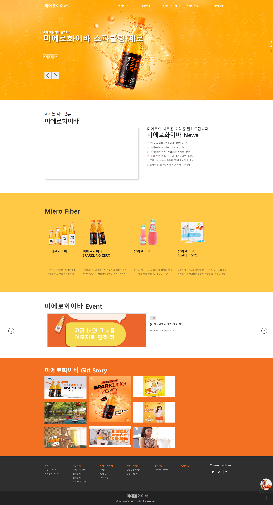
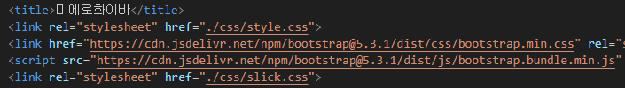
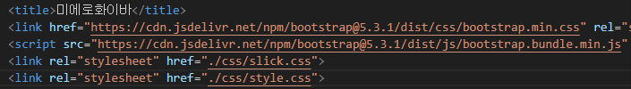
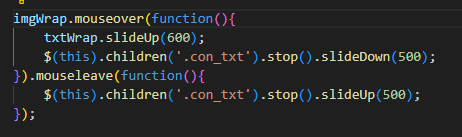
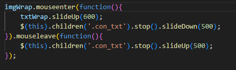

# PORTFOLIO_MieroFiber 🥂
 

# 📖 Description
[미에로화이바] 사이트를 참고한 클론 코딩 및 리디자인한 프로젝트입니다.
### 📌 개발 기간
2023.09.07 ~ 2023.10.18

### 📌 Stacks
#### [Environment]
VISUAL STUDIO CODE, GIT, GITHUB

#### [Development]
JavaScript, jQuery, BOOTSTRAP
 
 
# 🖥 화면 구성
#### [PC]

#### [Tablet]

#### [Mobile]

 

# ✨ 오류 수정

## 1️⃣ [logo 위 파란색 선]

#### ✔ WHY ?

css의 우선순위가 잘못 적용되어 있었음

스타일 적용 우선순위 => '인라인 방식 > 내부 방식 > 외부 방식 > 임포트 방식'

css의 우선순위의 중요성에 대해 다시 한 번 깨달음

#### ✔ HOW ?

#### [변경 전]

#### [변경 후]

 

## 2️⃣ [Section_5 Slide]

마우스가 텍스트 위 또는 주변에 있을 경우, 위와 같은 이상 현상이 발생함

#### ✔ WHY ?

mouseover와 mouseenter를 혼동하여 사용함

 

mouseover, mouseenter : 마우스 커서가 요소로 들어갈 때와 나갈 때 발생

그렇다면, 둘의 차이점은 ?

mouseover : 내부 div 태그 안에 들어가도 이벤트를 발생시킴

=> 자식 요소에도 이벤트가 발생하는 문제 발생 가능성 有

mouseenter : 객체의 안에 있는지 외부에 있는지만 따지기 때문에 이벤트가 한 번만 발생함 

=> 자식 요소에 이벤트 영향을 주지 않음

#### ✔ HOW ?

#### [변경 전]

#### [변경 후]

